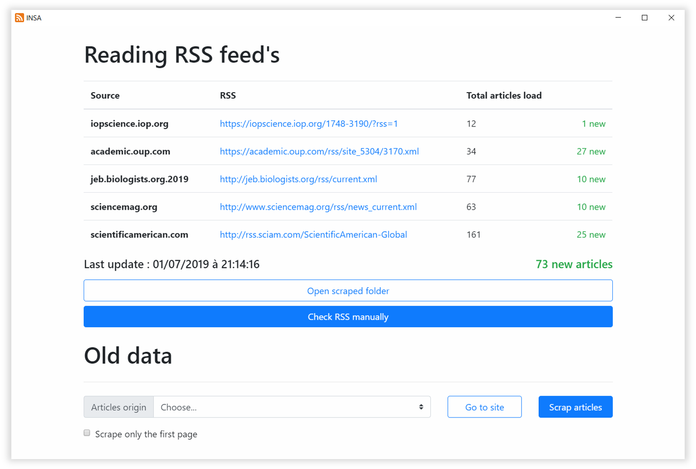

# Interface for data scraping

Interface for data scraping on scientific web sites.
Based on [ELECTRON](https://electronjs.org/).



## Getting Started

### Prerequisites

ELECTRON is based on Node.js, in order to run an electron app you need to [install Node.js](https://nodejs.org/en/download/)

To check that Node.js and npm are install :
```
node -v
npm -v
```
Before using the application you have to update the dependancies. Launch the cmd in the main folder of the project and use :
```
npm update
```

### Running the app

Open the cmd in the main folder of the project, then use the following command :
```
npm start
```

## Files organisation
- [main.js](main.js) : Manage the Electron app and events with the system
- [/vendor](/vendor) : external dependancies (bootstrap CSS)
- [/ressources](/ressources) : where the app stock files
  - [/scraped](ressources/scraped) : Destination folder of the scraped files
  - [/train](ressources/train) : Data used to train the classification algorithms
- [/app](/app) : App source code and configuration
  - [/conf](app/conf) : Configuration files for the javascript, used to scrap data
  - [/src](app/src) : Source code of the app
    - [/javascript](app/src/javascript) : code to scrap old and new articles
    - [/python](app/src/python) : code for classification and cosine-similarity
    - [index.html](app/src/index.html) : interface displayed
